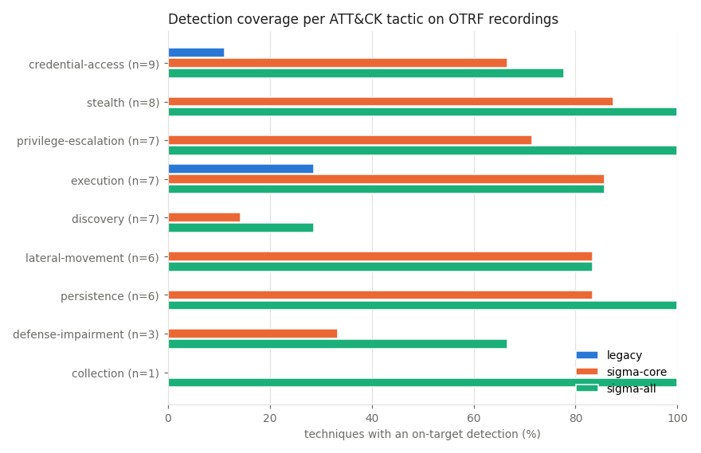
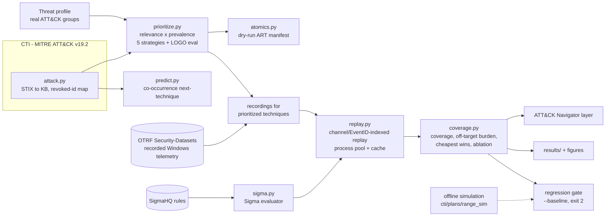

# GAUNTLET

[](https://github.com/rakshit-737/gauntlet/actions/workflows/ci.yml)

[](LICENSE)


**Threat-informed purple-team coverage scoring: rank ATT&CK techniques by what real actors do, replay real recorded attacks through your Sigma rules, and get a measured coverage matrix, the cheapest gaps to close, and a CI regression gate.**

Purple-teaming is usually manual and unprioritized. GAUNTLET closes the loop
**CTI → prioritized emulation plan → telemetry → detections → coverage → ranked gaps → regression gate**,
using only public data:

| Stage | Real data used |
|---|---|
| Prioritize | MITRE ATT&CK Enterprise v19.2: 176 groups, 697 techniques, procedure-based prevalence |
| Emulate | Atomic Red Team Windows index (1,253 tests) as a dry-run manifest, plus **replay of OTRF Security-Datasets**: 96 recordings of real technique executions (754k Windows events) |
| Detect | SigmaHQ release r2026-07-01, 2,519 Windows rules run by an in-process Sigma evaluator |
| Score | Per-technique coverage, off-target alert burden, threat-weighted coverage, per-tactic view, ATT&CK Navigator layers |

> Lab-only project. GAUNTLET **never executes attack techniques**. It reads recorded logs and prints
> test names. See [Safety](#lab-only-safety-note).

## Headline results (real data)

Full tables: [`results/RESULTS.md`](results/RESULTS.md). Reproduce with `python -m gauntlet bench`.

**Detection coverage on 96 OTRF recordings covering 54 ATT&CK techniques**

| Rule set | Rules | Technique coverage | Exact-ID coverage | w/o rules citing OTRF data | Recordings detected | Off-target alerts / 10k events |
|---|---:|---:|---:|---:|---:|---:|
| Baseline: GAUNTLET v0.1 hand-written rules | 6 | 5.6% | 3.7% | n/a | 3.1% | 0.23 |
| SigmaHQ *core* (stable/test, high/critical) | 1,365 | **66.7%** | 57.4% | 61.1% | 53.1% | 11.2 |
| SigmaHQ *all* Windows rules | 2,519 | **81.5%** | 66.7% | 77.8% | 69.8% | 53.7 |

The baseline is 6 of the 7 v0.1 rules in `rules/`. The password-spray rule is a count threshold with no Sigma equivalent here, so it is not replayed.

- **Coverage sprint.** The v0.1 baseline covers 5.6% of recorded techniques. Adding only the **10 greedily chosen "cheapest-win" Sigma rules** takes it to **35.2%**, or 44.6% when weighted by the ransomware profile.
- **Precision cost.** Going from *core* to *all* adds 15 points of coverage and roughly 5x the off-target alerts (11 to 54 per 10k events).
- **Telemetry ablation** (core rules). Dropping Sysmon loses 5 detected techniques. Dropping the Security log loses 3. Dropping PowerShell/Operational loses 1.
- **Blind spots.** Discovery is the weakest tactic: 1 of 7 recorded discovery techniques is detected by core rules.

**Research question: does CTI-prioritized emulation reach relevant coverage faster than breadth-first?**
Leave-one-group-out test: rank the 266 ART-emulatable techniques using every *other* group in the profile, then measure how fast each ordering covers the held-out actor's techniques.

| Profile (held-out groups) | CTI (relevance × prevalence) steps to 80% | Breadth-first (ATT&CK ID order) | Random | AUC CTI vs breadth |
|---|---:|---:|---:|---:|
| ransomware (18) | **118.9** | 194.4 | 211.9 | 0.718 vs 0.568 |
| espionage (57) | **103.2** | 196.8 | 211.2 | 0.761 vs 0.580 |
| financial (24) | **123.7** | 201.9 | 211.8 | 0.727 vs 0.569 |
| cloud (4) | 147.2 (prevalence alone: **123.0**) | 196.2 | 210.7 | 0.692 vs 0.577 |

<p align="center"></p>

The answer is **yes**. CTI ordering needs 39-48% fewer emulations than breadth-first to reach 80% of a held-out actor's techniques on the three larger profiles (25% on the 4-group cloud profile).
Profile-specific relevance adds little on top of global ATT&CK prevalence: `prevalence` alone ties `cti` on espionage and financial, and beats it on cloud, where only 4 groups inform the relevance term. Most of the value comes from "what is common everywhere", not from actor-specific tailoring.

**Next-technique prediction.** An item-item co-occurrence model trained on ATT&CK group technique sets (leave-one-group-out, half of each group hidden) reaches recall@10 of 0.235, against 0.191 for a popularity baseline at sub-technique level. At technique level it is 0.311 against 0.278.

<p align="center"></p>

## Architecture



| Module | Purpose |
|---|---|
| `attack.py` | Parses ATT&CK STIX 2.1 into techniques, tactics, groups (software-inherited techniques included), prevalence and the revoked-id map (for example T1086 → T1059.001). A 426 KB derivative ships in the package |
| `prioritize.py` | Builds profiles from real groups (regex over group descriptions or explicit IDs) and ranks with the `cti`, `relevance`, `prevalence`, `breadth` and `random` strategies. Includes the leave-one-group-out evaluation |
| `sigma.py` | Evaluates SigmaHQ YAML directly. Supports the full condition grammar (except aggregations), 20+ modifiers, Sysmon/Security-4688/PowerShell logsource and field mapping. Anything unsupported is reported, never silently ignored |
| `mordor.py`, `replay.py` | Load OTRF recordings (zip or tar.gz, JSON lines) and replay them through a rule set indexed by `(channel, EventID)`, in parallel and cached |
| `coverage.py` | Scores family and exact-ID matches, off-target alert burden, threat-weighted coverage, greedy cheapest-win rules and channel ablation, and exports ATT&CK Navigator 4.5 layers |
| `predict.py` | Item-item cosine co-occurrence model with leave-one-group-out evaluation against a popularity baseline |
| `atomics.py` | Atomic Red Team Windows index and a DRY-RUN manifest in priority order |
| `bench.py`, `figures.py` | The whole benchmark, which writes `results/` |
| `cti.py`, `plans.py`, `range_sim.py`, `detect.py`, `score.py` | The v0.1 offline simulation, kept as a zero-download demo of the regression gate |

Design decisions are recorded in [`docs/adr/`](docs/adr/).

## Quickstart

```bash
pip install -r requirements.txt

# Works offline (ATT&CK KB + ART index ship with the package)
python -m gauntlet profiles                                  # real ATT&CK groups per profile
python -m gauntlet plan --profile ransomware --top 15        # CTI-prioritized emulation plan
python -m gauntlet plan --profile APT29,G0007 --top 10       # custom profile from groups
python -m gauntlet predict --observed T1566.001,T1059.001    # likely next techniques
python -m gauntlet manifest --profile ransomware --top 10 --out plan.json   # DRY-RUN ART manifest

# Real data (~117 MB, pinned + SHA-256 verified)
export GAUNTLET_DATA_DIR=/path/outside/repo                   # default ./data (git-ignored)
python scripts/download_data.py
python -m gauntlet replay --profile ransomware --top 15 --ruleset sigma-core \
       --navigator layer.json --json baseline.json            # coverage on real recordings
python -m gauntlet replay --profile ransomware --top 15 --ruleset sigma-core \
       --baseline baseline.json                               # exit 2 on a coverage regression
python -m gauntlet bench                                      # full benchmark -> results/
```

`make` targets exist (`make data`, `make bench`, `make demo`, `make test`) for systems that have make.

Example: `replay --profile ransomware --top 15 --ruleset sigma-core` (abridged):

```text
Replaying 33 recordings for 15 prioritized techniques (profile 'ransomware', 18 groups) through sigma-core ...

    technique    prio  tactic                result   detections
[~] T1059       0.944  execution             partial  PCRE.NET Package Image Load; PCRE.NET Package Temp Files
[-] T1059.001   0.556  execution             missed   -
[+] T1003       0.549  credential-access     detected DPAPI Domain Backup Key Extraction
[+] T1021       0.535  lateral-movement      detected CobaltStrike Service Installations - Security; ...
[-] T1547.001   0.494  persistence           missed   -
[+] T1543.003   0.473  persistence           detected Suspicious Service Path Modification
[~] T1003.001   0.418  credential-access     partial  HackTool - Dumpert Process Dumper Default File; ...
[-] T1135       0.403  discovery             missed   -
...
Technique coverage: 56%  threat-weighted: 61%  off-target rules/recording: 1.5
```

The top-priority gaps are PowerShell (T1059.001), Run keys (T1547.001) and discovery. For T1547.001 the full SigmaHQ set *does* detect both recordings, but only with medium-level rules that the *core* filter drops. That is exactly the kind of trade-off the coverage matrix is meant to surface.

Load `layer.json` or `results/navigator-*.json` in [ATT&CK Navigator](https://mitre-attack.github.io/attack-navigator/) to view coverage as a heatmap: green = detected, amber = partial, red = missed.

## Datasets

| Dataset | Version | Size | Licence |
|---|---|---:|---|
| [MITRE ATT&CK Enterprise STIX](https://github.com/mitre-attack/attack-stix-data) | v19.2 | 54 MB | ATT&CK Terms of Use (attribution) |
| [SigmaHQ rules](https://github.com/SigmaHQ/sigma) | r2026-07-01 | 3 MB | Detection Rule License 1.1 |
| [OTRF Security-Datasets](https://github.com/OTRF/Security-Datasets) (Mordor), Windows atomic host recordings | commit `d9d40ef1` | 60 MB | MIT |
| [Atomic Red Team](https://github.com/redcanaryco/atomic-red-team) Windows index | commit `388942ad` | 0.2 MB | MIT |

Details, caveats and citations are in [`docs/DATASETS.md`](docs/DATASETS.md). No dataset is committed. Only small derived artefacts are: the KB JSON, the ART index JSON and `results/`.

## Reproducibility

- Every source is pinned (git commit for OTRF and Atomic Red Team, release tag for SigmaHQ, versioned file name for ATT&CK) and verified against [`scripts/checksums.sha256`](scripts/checksums.sha256).
- `python -m gauntlet bench` is deterministic. Random baselines use fixed seeds, 30 per held-out group. Replay results are cached under `$GAUNTLET_DATA_DIR/cache`. A cold run takes about 25 minutes on a 16-core laptop; a cached re-run takes about a minute.
- CI (`.github/workflows/ci.yml`) runs ruff and the 76-test suite on Python 3.10/3.12/3.13 without downloads; the 2 `@pytest.mark.realdata` tests are skipped there and pass locally once the data is present.

## Prior art and how this differs

| Existing | What it does well | GAUNTLET's angle |
|---|---|---|
| MITRE Caldera | Full adversary emulation | Coverage measurement and CTI prioritization are first-class, and the output is a measured matrix |
| Atomic Red Team | Library of atomic tests | GAUNTLET consumes its index as the emulation universe and orders it by CTI |
| VECTR | Purple-team result tracking | Automatic CTI priority, machine-scored outcomes on recorded telemetry, a CI regression gate |
| DeTT&CT / ATT&CK Navigator | Manual data-source and coverage scoring | Coverage here is *measured* by replaying attacks, not self-assessed. Output is a Navigator layer |
| SigmaHQ regression tests / EVTX-ATTACK-SAMPLES | Rule-level true-positive checks | Technique-level coverage, weighted by threat profile, with off-target burden and ablations |

GAUNTLET does not reinvent emulation. Its contribution is the reproducible closed loop, and the honest measurement at each stage of it.

## Limitations

- **Small technique universe.** The OTRF recordings cover 54 techniques, skewed toward 2019-2020 Empire/Mimikatz-era credential access and lateral movement. Coverage of 81.5% here does not mean 81.5% of ATT&CK.
- **Possible rule/data leakage.** Some SigmaHQ rules were written or tuned against these public recordings. The *w/o rules citing OTRF data* column removes rules whose references or description cite OTRF, Security-Datasets or the Threat Hunter Playbook. Coverage drops by 4-6 points. Uncited influence cannot be excluded.
- **"Off-target" is not a false-positive rate.** The recordings contain lab background activity and adjacent attack steps. The off-target figures are an upper bound on alert burden in one small lab, not a production FP rate.
- **Ground truth is coarse.** Each recording is labelled with its technique(s) and GAUNTLET scores at recording level, not event level. Family matching (for example T1059 vs T1059.001) is the headline number, with exact-ID coverage shown alongside.
- **CTI bias.** ATT&CK procedure examples measure *reporting* frequency. That favours well-studied actors and older tradecraft. Profiles are regex-selected from group descriptions: 18 ransomware, 57 espionage, 24 financial and only 4 cloud groups.
- **Evaluator divergence.** The in-house Sigma evaluator may differ from production backends in edge cases (regex dialect, case-insensitive field names). 35 of 2,554 Windows rules are unsupported (mostly log sources absent from the recordings), and aggregation/correlation rules are not evaluated.
- **Local AV.** Windows Defender may quarantine 2 recordings that contain attack-tool strings. They are skipped and counted.

## Roadmap

- [x] Real CTI prevalence and profiles (ATT&CK v19.2)
- [x] Sigma detection scoring on real recorded telemetry
- [x] ATT&CK Navigator export, cheapest wins, telemetry ablation
- [x] Research question: CTI vs breadth-first (leave-one-group-out)
- [x] Technique co-occurrence prediction
- [ ] Run the ART manifest in the isolated Docker/VM range and replay its Sysmon logs (the loader already accepts JSON-lines events)
- [ ] Event-level ground truth (OTRF compound datasets with timelines)
- [ ] ML detector (FEINT) as a fourth rule set next to Sigma
- [ ] Red Canary Threat Detection Report weights as an alternative prevalence source
- [ ] Sigma correlation/aggregation rules

## Lab-only safety note

- GAUNTLET has **no code path that executes an attack technique**. Real-data mode reads recorded logs. Simulation mode emits inert event dicts; a test checks they contain only `.invalid` domains and lab IPs.
- `gauntlet manifest` prints Atomic Red Team test names and GUIDs marked **DRY RUN**. Run them only inside an isolated, no-egress range that you own (`range/docker-compose.yml` uses an `internal: true` network, `cap_drop: [ALL]` and read-only containers), and never against third-party systems.
- No malware binaries or exploit code are downloaded or committed. See [ADR 0004](docs/adr/0004-safety-boundary.md), [THREAT_MODEL.md](THREAT_MODEL.md) and [SECURITY.md](SECURITY.md).

## Contributing and licence

See [CONTRIBUTING.md](CONTRIBUTING.md) and [CHANGELOG.md](CHANGELOG.md). MIT licensed ([LICENSE](LICENSE)). ATT&CK® is a registered trademark of The MITRE Corporation.
