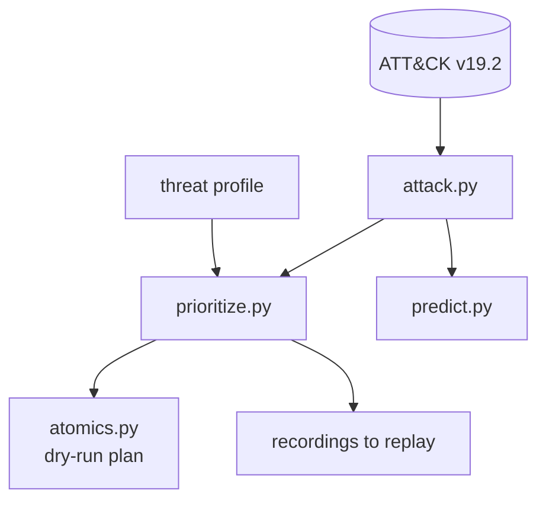
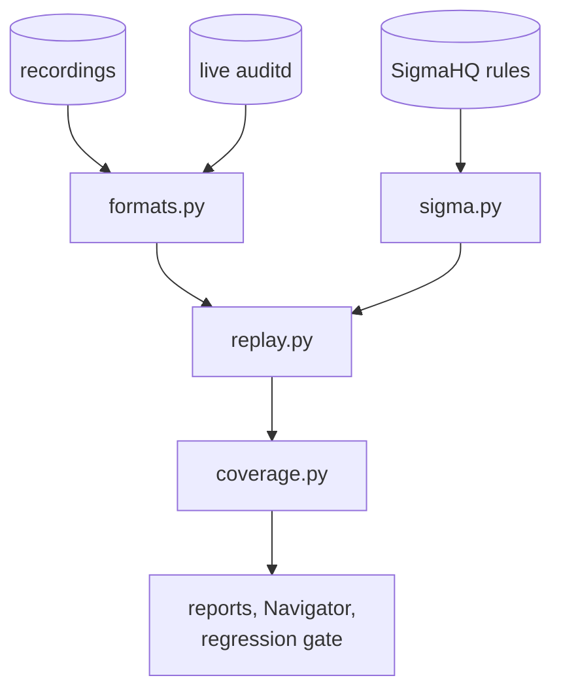

# GAUNTLET

[](https://github.com/rakshit-737/gauntlet/actions/workflows/ci.yml)

[](https://rakshit-737.github.io/gauntlet/)
[](LICENSE)


**GAUNTLET measures ATT&CK detection coverage instead of inferring it from rule tags.** It replays four recording sets from two public providers (OTRF and Splunk attack_data) and live, event-labelled auditd telemetry through unmodified SigmaHQ rules. On OTRF, tag-claimed coverage overstates measured coverage by **20.0 points** (95% Wilson [11.6, 32.4]): every one of the 55 recorded techniques has a tagged rule at family level, but only 80.0% [67.6, 88.4] are detected. On Splunk attack_data and the OTRF compound campaigns the SigmaHQ release package (medium and above, `sigma-all`) overstates by **59.0 to 76.9 points** (38.5 to 63.6 with the full tag's low-level and hunting rules, `sigma-full`; the compound sample is 13 techniques). As a control, GAUNTLET's Sigma evaluator fires on all 197 SigmaHQ regression samples it runs ([98.1, 100.0]), so the gap comes from the rules and the telemetry, not from the evaluator.

To our knowledge this is the first measured, interval-bounded gap between tag-claimed and replay-measured SigmaHQ coverage on public recordings plus live telemetry. [Virkud et al. (USENIX Security 2024)](https://www.usenix.org/conference/usenixsecurity24/presentation/virkud) argue from rule analysis that technique tags do not imply coverage of real threats; GAUNTLET measures how far apart the two are.

It also ranks techniques by what real ATT&CK groups do, turns gaps into the cheapest rules to add, and gates CI on coverage regressions. It uses only public data.

<p align="center"><a href="https://rakshit-737.github.io/gauntlet/demo/"></a></p>

**Docs:** <https://rakshit-737.github.io/gauntlet/>: [How it works](https://rakshit-737.github.io/gauntlet/how-it-works/), [Evaluation](https://rakshit-737.github.io/gauntlet/evaluation/), [Reproduce](https://rakshit-737.github.io/gauntlet/reproduce/) and the [live coverage explorer](https://rakshit-737.github.io/gauntlet/demo/).

## Try it in 60 seconds

```bash
python -m venv .venv && . .venv/bin/activate        # Windows: .venv\Scripts\activate
pip install "git+https://github.com/rakshit-737/gauntlet@v1.1.0"
gauntlet plan --profile ransomware --top 10          # CTI-prioritized emulation plan (offline)
gauntlet predict --observed T1566.001,T1059.001 -k 5 # likely next techniques
```

GAUNTLET is **not published on PyPI**: install from the v1.1.0 tag (above) or the wheel attached to the [v1.1.0 release](https://github.com/rakshit-737/gauntlet/releases/tag/v1.1.0). The PyPI name `gauntlet` belongs to an unrelated project, so never run `pip install gauntlet`. This distribution is named `gauntlet-coverage`; the import package and command stay `gauntlet`.

> Lab-only. The `gauntlet` package **never executes attack techniques**: it reads recorded logs and prints
> Atomic Red Team test names marked DRY RUN. One CI job runs an allowlist of benign, read-only discovery
> commands (`whoami`, `id`, `uname -a`, ...) on an ephemeral GitHub runner to collect auditd telemetry
> ([ADR 0005](docs/adr/0005-benign-live-emulation.md)). See [Safety](#lab-only-safety-note).

## Headline results

Every number below is in a committed file under [`results/`](results/), copied unedited from `benchmark` run [37094883465](https://github.com/rakshit-737/gauntlet/actions/runs/37094883465) and `live-telemetry` run [37092465944](https://github.com/rakshit-737/gauntlet/actions/runs/37092465944) on clean ubuntu-24.04 runners; each file names its run. Bracket types are labelled where they appear: Wilson intervals for proportions (computed from the raw counts and rounded once), percentile bootstrap intervals for weighted coverage and for strategy comparisons.

**1. Claimed vs measured coverage (the novel result).** *Claimed* means at least one rule is tagged with the technique's family; *measured* means such a rule actually fired on a recording of it. Technique coverage counts a technique as covered if any of its recordings is detected; *fully detected* requires all of them. SigmaHQ release package (`sigma-all`), 95% Wilson intervals ([`EXTENDED.md`](results/EXTENDED.md)):

<p align="center"></p>

| Source | Recordings | Techniques | Claimed by tags | Measured | Fully detected | Overstatement, points |
|---|---:|---:|---:|---:|---:|---:|
| OTRF atomic (Windows) | 98 | 55 | 100.0% [93.5, 100.0] | **80.0%** [67.6, 88.4] | 58.2% [45.0, 70.3] | 20.0 [11.6, 32.4] |
| OTRF compound LSASS campaigns | 7 | 13 | 100.0% [77.2, 100.0] | 23.1% [8.2, 50.3] | 23.1% [8.2, 50.3] | 76.9 [49.7, 91.8] |
| Splunk attack_data, Windows | 414 | 195 | 94.9% [90.8, 97.2] | 35.9% [29.5, 42.8] | 14.9% [10.6, 20.5] | 59.0 [52.0, 65.6] |
| Splunk attack_data, Linux | 154 | 55 | 70.9% [57.9, 81.2] | 10.9% [5.1, 21.8] | 1.8% [0.3, 9.6] | 60.0 [46.8, 71.9] |

- **Why an interval, not a p-value.** Measured coverage is nested in claimed coverage by construction (a technique can only be measured by a rule tagged with it), so every discordant technique points the same way. On OTRF the exact McNemar p is 0.001 (0.00098) from 11 discordant techniques, but it only restates that count, so the overstatement is reported as claimed-but-not-measured techniques / techniques with a Wilson interval.
- **Rule logic, not missing logs.** All 11 OTRF claimed-but-missed techniques are *rule-logic gaps*: events of a tagged rule's log source and event type are in the recording, but no tagged rule matched them. On Splunk, 93 of 115 (Windows) and 23 of 33 (Linux) are rule-logic gaps; the rest are telemetry gaps.
- **Not a family-matching artefact.** With exact technique IDs the OTRF gap is 27.3 points [17.3, 40.2].
- **More rules help a little.** Adding SigmaHQ's low-level and threat-hunting rules (`sigma-full`) raises OTRF coverage to 85.5% [73.8, 92.4] and Splunk Windows coverage to 37.9% [31.4, 44.9].
- **Control** ([`SELFTEST.md`](results/SELFTEST.md)). Each SigmaHQ positive regression sample replayed through the rule it was recorded for: 197 of 197 fire (100.0%, 95% Wilson [98.1, 100.0]).
- **Worse than v1.1.0 on Splunk Windows.** Splunk files are now routed by sourcetype, so the Windows parts of 16 mixed recordings are scored with Windows rules (398 to 414 recordings, 188 to 195 techniques). Measured coverage went from 36.2% to 35.9% and the overstatement from 58.5 to 59.0 points; with `sigma-full`, from 38.8% to 37.9%.

**2. Live telemetry vs replay.** A CI runner executes 9 benign discovery commands under auditd, and each audit record is labelled with the command that produced it ([`LIVE.md`](results/LIVE.md), live-telemetry run 37092465944). Four runs (36995051317, 36998137511, 37016216096 and 37092465944) gave identical per-command outcomes ([`live-history.json`](results/live-history.json)).

- The SigmaHQ release package detects **0 of 4** of these techniques. The full tag (with low and informational rules) detects **3 of 4** (T1033, T1082, T1057; 95% Wilson [30.1, 95.4]). With n = 4 these are per-command outcomes, not a rate.
- None of the 12 Splunk Linux recordings of the same techniques is detected. The 8 auditd extracts contain no `EXECVE` record, so no command line exists for a process-creation rule to match. The 4 Sysmon for Linux recordings do record `id` and `crontab -l`, but the rules that fire on them are tagged T1087.001 and T1007.
- `whoami` is detected, but `/usr/bin/whoami` is not, because the rule matches `a0 == "whoami"` literally.
- `crontab -l` is labelled T1053.003 (Scheduled Task/Job: Cron) by the live job and by Splunk, but SigmaHQ tags its rule T1007 (System Service Discovery): a taxonomy disagreement, not a detection miss.

**3. Rule sets on OTRF** ([`RESULTS.md`](results/RESULTS.md), 95% Wilson intervals):

| Rule set | Rules | Technique coverage | Fully detected | Exact-ID | w/o OTRF-citing rules | Recordings detected | Off-target alerts / 10k events (descriptive) |
|---|---:|---:|---:|---:|---:|---:|---:|
| GAUNTLET v0.1 hand-written | 6 | 5.5% [1.9, 14.9] | 1.8% [0.3, 9.6] | 3.6% [1.0, 12.3] | n/a | 3.1% [1.0, 8.6] | 0.22 |
| SigmaHQ *core* (stable/test, high/critical) | 1,365 | **65.5%** [52.3, 76.6] | 40.0% [28.1, 53.2] | 56.4% [43.3, 68.6] | 58.2% [45.0, 70.3] | 52.0% [42.3, 61.7] | 11.1 |
| SigmaHQ release package (medium+) | 2,519 | **80.0%** [67.6, 88.4] | 58.2% [45.0, 70.3] | 65.5% [52.3, 76.6] | 76.4% [63.7, 85.6] | 68.4% [58.6, 76.7] | 53.5 |

- Core to release package: 8 of 55 techniques gained (+14.5 points, 95% Wilson [7.6, 26.2]) and none lost (core is a subset), for about 5x the off-target alerts.
- Leakage control (dropping rules that cite OTRF and its authors) costs *core* 4 of 55 techniques: -7.3 points [2.9, 17.3], from 65.5% to 58.2%.
- Adding the top-10 greedy cheapest-win rules **from the release package** to the v0.1 baseline takes it from 5.5% (3 of 55) to 34.5% (19 of 55, Wilson [23.4, 47.7]); ransomware-weighted 43.8% (bootstrap [30.3, 58.6]). That result is in-sample, so the intervals do not cover the rule selection.
- Out of sample, the same greedy selection does not transfer. Ten rules chosen on OTRF cover 0.5% (1 of 195, [0.1, 2.8]) and 1.0% (2 of 195, [0.3, 3.7]) of Splunk Windows techniques, no better than 10 random OTRF-firing rules (mean 0.9%; 2.5-97.5 percentile of 200 draws [0.0, 2.1]).
- Discovery is the weakest tactic with more than one technique: 1 of 8 is detected by *core* (Wilson [2.2, 47.1]).

**4. Does CTI-prioritized emulation beat breadth-first?** In a leave-one-group-out test, CTI ordering reaches 80% of a held-out actor's techniques in 118.9 [114.3, 123.3] / 103.2 [95.2, 111.0] / 123.7 [117.6, 129.9] emulations, against 194.4 [185.8, 202.0] / 196.8 [189.7, 203.0] / 201.9 [193.5, 209.8] for breadth-first (ransomware / espionage / financial; percentile bootstrap over held-out groups). For ransomware the paired difference is -75.5 steps (paired bootstrap [-85.0, -65.8], sign test p < 0.0001). Breadth-first (ATT&CK ID order) beats random only modestly: -17.5 steps [-25.6, -10.5] and +0.066 AUC [0.053, 0.079] for ransomware (sign test p = 0.00754). Most of the CTI gain is global prevalence: actor-specific relevance saves 8.0 steps [3.9, 12.2] for ransomware (sign test p = 0.000145) and nothing measurable for espionage (+0.0 [-1.0, +0.9]) or financial (-0.8 [-3.6, +1.9]). The cloud profile has only 4 groups, and its differences are not statistically distinguishable (sign test p = 0.125).

<p align="center"></p>

**5. Next-technique prediction.** A co-occurrence model beats popularity on recall@10: +0.044 [+0.026, +0.064] at sub-technique level and +0.034 [+0.021, +0.048] at technique level (paired bootstrap over held-out groups). MRR does not separate them: +0.032 [-0.018, +0.079] and -0.017 [-0.054, +0.021].

**6. Published numbers** ([`PUBLISHED.md`](results/PUBLISHED.md)). CTID's *Top ATT&CK Techniques* flags 50 of 53 OTRF techniques as having a Sigma rule (94.3%, Wilson [84.6, 98.1]); 42 are measured as detected (79.2% [66.5, 88.0]). The two are not nested, so an exact McNemar test applies: p = 0.057 (11 vs 3 discordant techniques), not significant at 0.05. RedGap's `docs/benchmarks/coverage.json` (commit `a9bcbf2c`) reports 33 of 51 Linux techniques detected in its benign lab; per-technique agreement with GAUNTLET's live run is listed. Neither is like-for-like (different snapshots and telemetry). No published SigmaHQ technique coverage on OTRF or Splunk recordings exists to compare with.

## Architecture

GAUNTLET has two halves. **Plan** turns CTI into a ranked list of techniques, a dry-run emulation plan and the recordings to replay. **Measure** replays recorded and live telemetry through Sigma rules and scores coverage. The diagrams name modules only; the table says what each one does.

**Plan: from CTI to what to emulate**



**Measure: from telemetry to coverage**



*Recordings* are OTRF atomic and compound and Splunk attack_data; *live auditd* is the event-labelled CI job; *reports* are `results/` from `bench`, `extended`, `live`, `compare` and `selftest`. The offline simulation (`cti.py`, `plans.py`, `range_sim.py`) feeds the same regression gate without any download.

| Module | Purpose |
|---|---|
| `attack.py` | Parses ATT&CK STIX 2.1 into techniques, tactics, groups (software-inherited techniques included), prevalence and the revoked-id map (for example T1086 → T1059.001). A 426 KB derivative ships in the package |
| `prioritize.py` | Builds profiles from real groups (regex over group descriptions or explicit IDs) and ranks with the `cti`, `relevance`, `prevalence`, `breadth` and `random` strategies. Includes the leave-one-group-out evaluation |
| `sigma.py` | Evaluates SigmaHQ YAML directly: the full condition grammar except aggregations, more than 20 modifiers, and Windows (Sysmon, Security 4688, PowerShell) and Linux (Sysmon for Linux, auditd) logsources. Anything unsupported is reported, never silently ignored |
| `formats.py`, `mordor.py`, `replay.py` | Parse JSON-lines, XML-event and raw auditd recordings (OTRF atomic and compound, Splunk), and replay them through a rule set indexed by `(channel, EventID)`, in parallel and cached |
| `coverage.py` | Scores family and exact-ID matches, off-target alert burden, threat-weighted coverage, greedy cheapest-win rules and channel ablation, and exports ATT&CK Navigator 4.5 layers |
| `extended.py`, `live.py`, `published.py` | Cross-dataset claimed-vs-measured analysis and held-out rule selection; live auditd scoring with event-level labels and the Splunk replay completeness profile; comparison with CTID and RedGap |
| `selftest.py` | Evaluator fidelity control: SigmaHQ's own regression samples replayed through the rules they were recorded for |
| `predict.py` | Item-item cosine co-occurrence model with leave-one-group-out evaluation against a popularity baseline |
| `atomics.py` | Atomic Red Team Windows index and a DRY-RUN manifest in priority order |
| `bench.py`, `figures.py` | The OTRF benchmark, which writes `results/` |
| `stats.py`, `paths.py` | Wilson, bootstrap and exact tests (unrounded; display rounds once); data locations and run provenance |
| `cti.py`, `plans.py`, `range_sim.py`, `detect.py`, `score.py` | The v0.1 offline simulation, kept as a zero-download demo of the regression gate |

Design decisions are recorded in [`docs/adr/`](docs/adr/).

## Quickstart (from a checkout)

```bash
pip install -e .

# Works offline (ATT&CK KB + ART index ship with the package)
gauntlet profiles                                  # real ATT&CK groups per profile
gauntlet plan --profile ransomware --top 15        # CTI-prioritized emulation plan
gauntlet plan --profile APT29,G0007 --top 10       # custom profile from groups
gauntlet predict --observed T1566.001,T1059.001    # likely next techniques
gauntlet manifest --profile ransomware --top 10 --out out/plan.json   # DRY-RUN ART manifest

# Real data (~117 MB, pinned + SHA-256 verified; add --only ...,mordor-compound,splunk,published for ~65 MB more)
export GAUNTLET_DATA_DIR=/path/outside/repo        # default ./data (git-ignored)
python scripts/download_data.py
gauntlet replay --profile ransomware --top 15 --ruleset sigma-core \
       --navigator out/layer.json --json out/baseline.json   # coverage on real recordings
gauntlet replay --profile ransomware --top 15 --ruleset sigma-core \
       --baseline out/baseline.json                          # exit 2 on a coverage regression
gauntlet bench --out out                                     # OTRF benchmark
```

Exact commands, expected outputs and runtimes for every published number are in [Reproduce](https://rakshit-737.github.io/gauntlet/reproduce/).

Example: `replay --profile ransomware --top 15 --ruleset sigma-core` (abridged; captured in benchmark run 37094883465, full output in [`results/replay-ransomware-top15.txt`](results/replay-ransomware-top15.txt)):

```text
Replaying 33 recordings for 15 prioritized techniques (profile 'ransomware', 18 groups) through sigma-core ...

    technique    prio  tactic                result   detections
[~] T1059       0.944  execution             partial  PCRE.NET Package Image Load; PCRE.NET Package Temp Files
[-] T1059.001   0.556  execution             missed   -
[+] T1003       0.549  credential-access     detected DPAPI Domain Backup Key Extraction
[+] T1021       0.535  lateral-movement      detected CobaltStrike Service Installations - Security; ...
[-] T1547.001   0.494  persistence           missed   -
[~] T1112       0.481  persistence           partial  NetNTLM Downgrade Attack; NetNTLM Downgrade Attack - Registry
[+] T1543.003   0.473  persistence           detected Suspicious Service Path Modification
[~] T1047       0.432  execution             partial  T1047 Wmiprvse Wbemcomn DLL Hijack; Wmiprvse Wbemcomn DLL Hijack
...

Technique coverage: 56%  threat-weighted: 61%  off-target rules/recording: 1.5
```

The 56% is 10 of the 18 techniques labelled on the 33 chosen recordings (Wilson [33.7, 75.4]), which include 3 co-labelled techniques beyond the 15 prioritized ones; over the 15 prioritized techniques alone it is 9 of 15 = 60% [35.7, 80.2]. For T1547.001 the full SigmaHQ package *does* detect both recordings, but only with medium-level rules that the *core* filter drops.

Load `out/layer.json` or `results/navigator-*.json` in [ATT&CK Navigator](https://mitre-attack.github.io/attack-navigator/) to view coverage as a heatmap: green = detected, amber = partial, red = missed.

## Datasets

| Dataset | Version | Size | Licence |
|---|---|---:|---|
| [MITRE ATT&CK Enterprise STIX](https://github.com/mitre-attack/attack-stix-data) | v19.2 (commit `6cda5ad8`) | 54 MB | ATT&CK Terms of Use (attribution) |
| [SigmaHQ rules](https://github.com/SigmaHQ/sigma) | r2026-07-01 release package (+ tag checkout for `sigma-full`) | 3 MB (+30 MB) | Detection Rule License 1.1 |
| [OTRF Security-Datasets](https://github.com/OTRF/Security-Datasets), Windows atomic + compound host recordings | commit `d9d40ef1` | 60 + 22 MB | MIT |
| [Splunk attack_data](https://github.com/splunk/attack_data), Windows XML + Linux Sysmon/auditd, files ≤ 2 MB | commit `b4573ed3` | 39 MB | Apache-2.0 |
| [Atomic Red Team](https://github.com/redcanaryco/atomic-red-team) Windows index | commit `388942ad` | 0.2 MB | MIT |
| [CTID Top ATT&CK Techniques](https://github.com/center-for-threat-informed-defense/top-attack-techniques), [RedGap](https://github.com/befnoz/redgap) coverage | `87cc589e`, `a9bcbf2c` | 3.9 MB | Apache-2.0, MIT |

Details, caveats and citations are in [`docs/DATASETS.md`](docs/DATASETS.md). No dataset is committed. Only small derived artefacts are committed: the KB JSON, the ART index JSON, the Splunk manifest and `results/`.

## Reproducibility

- Every source is pinned (git commit or release tag) and verified against [`scripts/checksums.sha256`](scripts/checksums.sha256), or against git-LFS sha256 oids for Splunk.
- The committed `results/` are copied unedited from `benchmark` run [37094883465](https://github.com/rakshit-737/gauntlet/actions/runs/37094883465) and `live-telemetry` run [37092465944](https://github.com/rakshit-737/gauntlet/actions/runs/37092465944), and each file names the run and commit that produced it. The benchmark job runs with `pipefail`, writes into a fresh directory and fails unless every expected file was written by that run. On its 4-core runner `bench` takes about 3 minutes cold and `extended` about 4.
- [`scripts/verify_results.py`](scripts/verify_results.py) compares a reproduction with `results/` field by field (ignoring only timing and provenance) and exits 1 on any difference. Random baselines and bootstraps use fixed seeds, and the replay cache is keyed by a fingerprint of the rules and evaluator code.
- CI runs ruff, the offline tests on Python 3.11-3.14, the replay tests against the installed wheel, sdist and container smoke tests, pip-audit and gitleaks. The `@pytest.mark.realdata` tests run locally once the data is present.

## Prior art and how this differs

| Existing | What it does well | GAUNTLET's angle |
|---|---|---|
| MITRE Caldera | Full adversary emulation | Coverage measurement and CTI prioritization are first-class; the output is a measured matrix |
| Atomic Red Team | Library of atomic tests | GAUNTLET consumes its index as the emulation universe and orders it by CTI |
| VECTR | Purple-team result tracking | Automatic CTI priority, machine-scored outcomes on recorded telemetry, a CI regression gate |
| DeTT&CT / ATT&CK Navigator | Manual data-source and coverage scoring | Coverage is *measured* by replay; the gap to tag-claimed coverage is quantified with intervals |
| SigmaHQ regression tests / EVTX-ATTACK-SAMPLES | Rule-level true-positive checks | Technique-level coverage, weighted by threat profile, with off-target burden and ablations; GAUNTLET also reuses SigmaHQ's regression samples as its evaluator control |
| [Dredd](https://github.com/SecurityRiskAdvisors/dredd) (2020) | Replays Mordor through Sigma in Elasticsearch | Publishes no coverage numbers; GAUNTLET adds CIs, CTI weighting and more data sources |
| [RedGap](https://github.com/befnoz/redgap) (2026) | Benign Linux lab + replay, silent-rule report | Single lab, Linux only, unweighted; GAUNTLET is cross-source (OTRF, Splunk, live) and compares outcomes with it |
| [CTID Top ATT&CK Techniques](https://github.com/center-for-threat-informed-defense/top-attack-techniques) / [Technique Inference Engine](https://github.com/center-for-threat-informed-defense/technique-inference-engine) | Prevalence/choke-point prioritization; next-technique inference | GAUNTLET's prioritization and prediction are evaluated leave-one-group-out with CIs; its `has_sigma` flags are compared with measured coverage |
| [Virkud et al., USENIX Security 2024](https://www.usenix.org/conference/usenixsecurity24/presentation/virkud) | Analyses how Sigma and commercial rule sets use ATT&CK tags; finds that covering a technique does not consistently mean covering the same real threats | GAUNTLET measures that gap by replaying public recordings and live telemetry, with intervals |
| [Uetz et al., USENIX Security 2024](https://arxiv.org/abs/2311.10197) | Shows that almost half of widespread SIEM (Sigma) rules can be evaded with little effort, and detects evasions | Complementary: GAUNTLET measures what rules miss on unmodified recorded attacks, before any evasion |

GAUNTLET does not reinvent emulation. Its contribution is measuring, with uncertainty, how far tag-claimed coverage is from what rules actually detect, across recorded and live telemetry, inside a reproducible CTI-to-regression-gate loop.

## Limitations

- **Small technique universes.** OTRF covers 55 techniques, skewed toward 2019-2020 Empire/Mimikatz-era tradecraft. 80% there is not 80% of ATT&CK. Splunk adds 195 Windows and 55 Linux techniques, but only from recordings with files of at most 2 MB.
- **Labels.** OTRF and Splunk are labelled per recording. Only the live job has event-level labels, and it covers 4 benign discovery techniques. Labels and rule tags can disagree (T1053.003 vs T1007 for `crontab -l`).
- **Possible rule/data leakage.** Rules that cite OTRF, Security-Datasets, the Threat Hunter Playbook or the OTRF co-founder's blog and handles are removed in the leakage-controlled column: sigma-core drops from 65.5% to 58.2% (-7.3 points [2.9, 17.3]). Uncited influence cannot be excluded.
- **"Off-target" is not a false-positive rate.** It is a descriptive upper bound on alert burden in one small lab.
- **Statistics.** Wilson intervals treat techniques and recordings as independent; clustering by technique family would widen them. The cloud profile (4 groups) cannot distinguish strategies. The cheapest-wins sprint is in-sample, and its out-of-sample check (OTRF to Splunk) shows no transfer.
- **Evaluator divergence.** The evaluator fires on all 197 SigmaHQ regression samples it runs, but those cover mostly Windows process-creation, registry and file rules; production backends may still differ in edge cases. 35 Windows rules are unsupported, and aggregation/correlation rules are not evaluated. auditd has no parent image, so `ParentImage` rules cannot fire on it. 43 Splunk events (8 recordings) have no parseable channel.
- **Local AV.** Windows Defender may quarantine OTRF and Splunk recordings; the downloader skips and records them. The published numbers therefore come from a Linux runner.

More detail: [docs/limitations.md](docs/limitations.md).

## Roadmap

- [x] Real CTI prevalence and profiles; Sigma scoring on real telemetry; Navigator export, cheapest wins, telemetry ablation
- [x] CTI vs breadth-first (leave-one-group-out); co-occurrence prediction; an interval or exact test for every reported statistic
- [x] Docs site, coverage explorer, container image, tagged releases (v1.0.0, v1.1.0)
- [x] OTRF compound and Splunk attack_data sources; claimed vs measured; held-out rule selection
- [x] Live auditd telemetry with event-level labels (benign allowlist, ADR 0005); published-number comparison
- [x] Evaluator self-test on SigmaHQ regression samples
- [ ] Regression-catch rate across consecutive SigmaHQ releases and rule-mutation testing
- [ ] Run the ART manifest in an isolated Windows VM range with Sysmon and replay its logs (out of scope on this workstation, ADR 0004)
- [ ] ML detector (FEINT) as another rule set. FEINT is a network-flow detector, not a host-log detector, so it is out of scope here
- [ ] Sigma correlation/aggregation rules (the pinned release ships no Windows correlation rules)

## Lab-only safety note

- The `gauntlet` package has **no code path that executes an attack technique**. Real-data mode reads recorded logs. Simulation mode emits inert event dicts, and a test checks that they contain only `.invalid` domains and lab IPs.
- The `live-telemetry` workflow runs a fixed allowlist of read-only discovery commands (`whoami`, `id`, `uname -a`, `hostname`, `cat /etc/os-release`, `ps -ef`, `crontab -l`, `ls /etc/cron.d`), plus `/usr/bin/whoami` as the full-path variant of `whoami`. It runs as the unprivileged user on an ephemeral GitHub-hosted runner, with no network use, credential access, persistence or privilege escalation. The script refuses to run anywhere else ([ADR 0005](docs/adr/0005-benign-live-emulation.md)).
- `gauntlet manifest` prints Atomic Red Team test names and GUIDs marked **DRY RUN**. Run them only inside an isolated, no-egress range that you own, and never against third-party systems.
- No malware binaries or exploit code are downloaded or committed. See [ADR 0004](docs/adr/0004-safety-boundary.md), [THREAT_MODEL.md](THREAT_MODEL.md) and [SECURITY.md](SECURITY.md).

## Contributing, citation and licence

See [CONTRIBUTING.md](CONTRIBUTING.md), [CHANGELOG.md](CHANGELOG.md) and [CITATION.cff](CITATION.cff). MIT licensed ([LICENSE](LICENSE)). ATT&CK® is a registered trademark of The MITRE Corporation.
