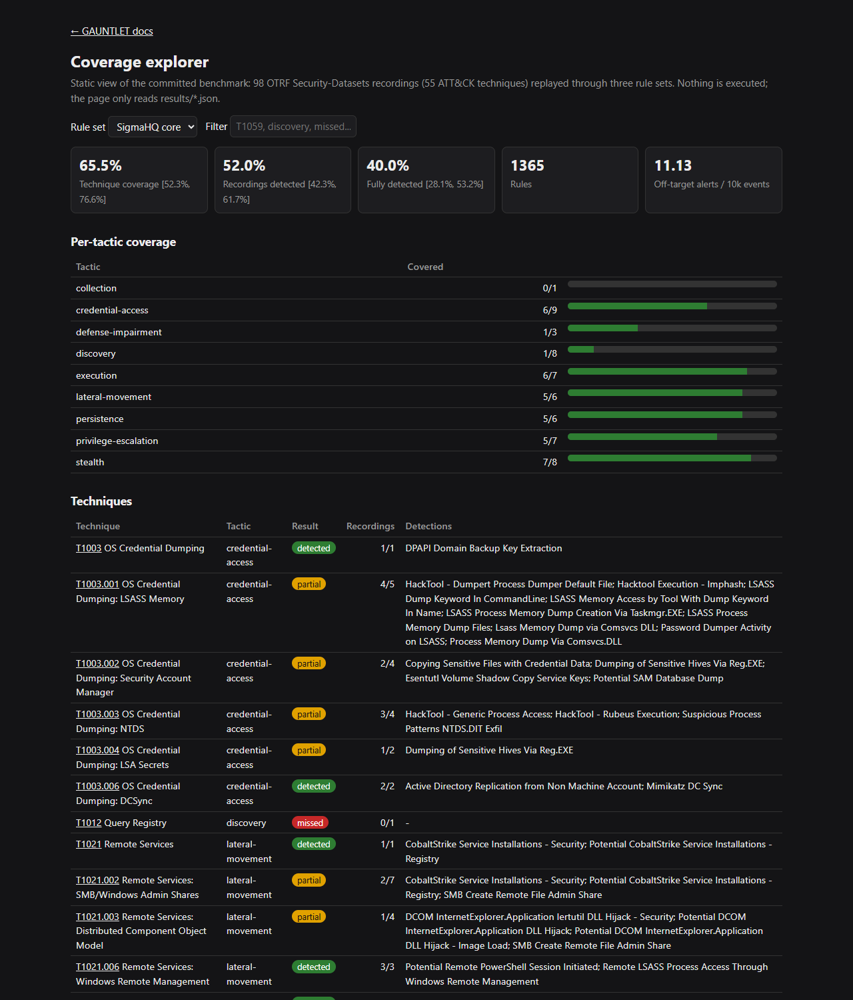
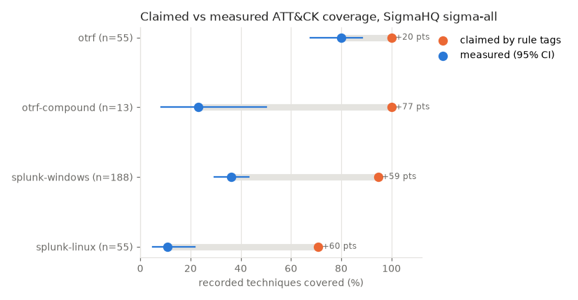
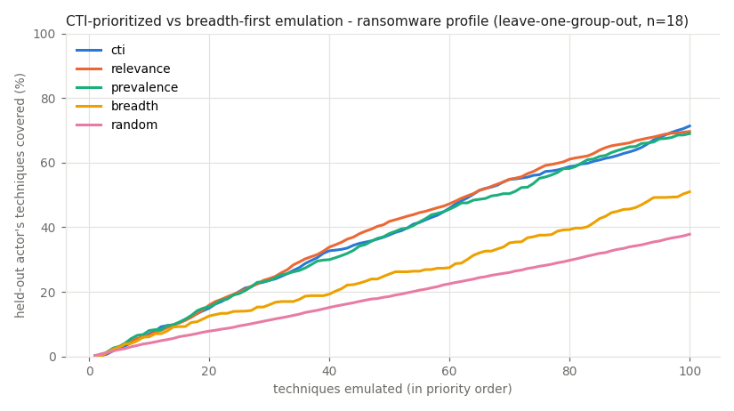
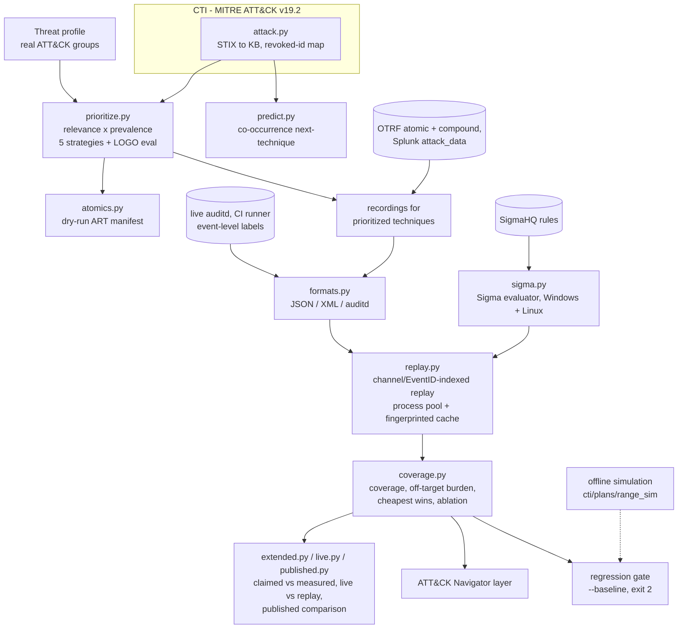

# GAUNTLET

[](https://github.com/rakshit-737/gauntlet/actions/workflows/ci.yml)

[](https://rakshit-737.github.io/gauntlet/)
[](LICENSE)


**GAUNTLET measures ATT&CK detection coverage instead of inferring it from rule tags.** It replays four public attack-recording sources and live, event-labelled auditd telemetry through unmodified SigmaHQ rules. Tag-claimed coverage overstates measured coverage by **20 points on OTRF** (100% claimed vs 80.0% [67.6, 88.4] measured, exact McNemar p < 0.001), and by **58-77 points on Splunk attack_data and OTRF compound campaigns**.

It also ranks techniques by what real ATT&CK groups do, turns gaps into the cheapest rules to add, and gates CI on coverage regressions. It uses only public data.

<p align="center"><a href="https://rakshit-737.github.io/gauntlet/demo/"></a></p>

**Docs:** <https://rakshit-737.github.io/gauntlet/>: [How it works](https://rakshit-737.github.io/gauntlet/how-it-works/), [Evaluation](https://rakshit-737.github.io/gauntlet/evaluation/), [Reproduce](https://rakshit-737.github.io/gauntlet/reproduce/) and the [live coverage explorer](https://rakshit-737.github.io/gauntlet/demo/). **Image:** `ghcr.io/rakshit-737/gauntlet`.

## Try it in 60 seconds

```bash
python -m venv .venv && . .venv/bin/activate        # Windows: .venv\Scripts\activate
pip install "git+https://github.com/rakshit-737/gauntlet@main"
gauntlet plan --profile ransomware --top 10          # CTI-prioritized emulation plan (offline)
gauntlet predict --observed T1566.001,T1059.001 -k 5 # likely next techniques
# no Python? the container works the same way:
docker run --rm ghcr.io/rakshit-737/gauntlet:latest plan --profile ransomware --top 10
```

The PyPI name `gauntlet` belongs to an unrelated project, so never run `pip install gauntlet`; this distribution is named `gauntlet-coverage` (import package and command stay `gauntlet`).

> Lab-only. The `gauntlet` package **never executes attack techniques**: it reads recorded logs and prints
> Atomic Red Team test names marked DRY RUN. One CI job runs an allowlist of benign, read-only discovery
> commands (`whoami`, `id`, `uname -a`, ...) on an ephemeral GitHub runner to collect auditd telemetry
> ([ADR 0005](docs/adr/0005-benign-live-emulation.md)). See [Safety](#lab-only-safety-note).

## Headline results

Every number below is in a committed file under [`results/`](results/), produced by the cold [`benchmark`](.github/workflows/benchmark.yml) and [`live-telemetry`](.github/workflows/live-telemetry.yml) workflows on clean ubuntu-24.04 runners. Brackets are 95% Wilson intervals.

**1. Claimed vs measured coverage (the novel result).** *Claimed* means at least one rule is tagged with the technique; *measured* means such a rule actually fired on a recording of it. Technique coverage counts a technique as covered if any of its recordings is detected, so partially detected techniques count. ([`EXTENDED.md`](results/EXTENDED.md))

<p align="center"></p>

| Source (SigmaHQ release package) | Recordings | Techniques | Claimed by tags | Measured | Fully detected | Exact McNemar p |
|---|---:|---:|---:|---:|---:|---:|
| OTRF atomic (Windows) | 98 | 55 | 100.0% | **80.0%** [67.6, 88.4] | 58.2% | 0.001 |
| OTRF compound LSASS campaigns | 7 | 13 | 100.0% | 23.1% [8.2, 50.3] | 23.1% | 0.002 |
| Splunk attack_data, Windows | 398 | 188 | 94.7% | 36.2% [29.6, 43.2] | 16.0% | < 1e-30 |
| Splunk attack_data, Linux | 154 | 55 | 70.9% | 10.9% [5.1, 21.8] | 1.8% | < 1e-9 |

Almost every claimed-but-missed technique is a *rule-logic gap*: the telemetry is in the recording, but no tagged rule matched it. Adding SigmaHQ's low-level and threat-hunting rules (`sigma-full`) raises OTRF coverage to 85.5% and Splunk Windows coverage to 38.8%.

**2. Live telemetry vs replay.** A CI runner executes 9 benign discovery commands under auditd, and each audit record is labelled with the command that produced it. ([`LIVE.md`](results/LIVE.md))

- The SigmaHQ release package detects **0 of 4** of these techniques. The full tag (with low and informational rules) detects **3 of 4** (T1033, T1082, T1057).
- Splunk's replayed auditd recordings of the same techniques are detected **0 times**: they contain no `EXECVE` records.
- `whoami` is detected, but `/usr/bin/whoami` is not, because the rule matches `a0 == "whoami"` literally.
- `crontab -l` is tagged T1007 upstream, so it does not count as cron discovery (T1053.003).

**3. Rule sets on OTRF** ([`RESULTS.md`](results/RESULTS.md)):

| Rule set | Rules | Technique coverage | Fully detected | Exact-ID | w/o OTRF-citing rules | Recordings detected | Off-target alerts / 10k events |
|---|---:|---:|---:|---:|---:|---:|---:|
| GAUNTLET v0.1 hand-written | 6 | 5.5% [1.9, 14.8] | 1.8% | 3.6% | n/a | 3.1% | 0.22 |
| SigmaHQ *core* (stable/test, high/critical) | 1,365 | **65.5%** [52.2, 76.6] | 40.0% | 56.4% | 58.2% | 52.0% | 11.1 |
| SigmaHQ release package (medium+) | 2,519 | **80.0%** [67.6, 88.4] | 58.2% | 65.5% | 76.4% | 68.4% | 53.5 |

- Core to all: 8 techniques gained, 0 lost (McNemar p = 0.008), for about 5x the off-target alerts.
- Adding the top-10 greedy cheapest-win rules **from the release package** to the v0.1 baseline takes it from 5.5% to 34.5% (43.8% ransomware-weighted). That result is in-sample.
- Out of sample, the same greedy selection does not transfer. Ten rules chosen on OTRF cover 0.5-1.1% of Splunk Windows techniques, no better than 10 random OTRF-firing rules (0.9% [0.0, 2.1]).
- Discovery is the weakest tactic with more than one technique: 1 of 8 is detected by *core*.

**4. Does CTI-prioritized emulation beat breadth-first?** In a leave-one-group-out test, CTI ordering reaches 80% of a held-out actor's techniques in 118.9 / 103.2 / 123.7 emulations, against 194.4 / 196.8 / 201.9 for breadth-first (ransomware / espionage / financial). The paired difference for ransomware is -75.5 steps [-85.0, -65.8]. Breadth-first (ATT&CK ID order) is close to random (AUC 0.57 vs 0.50), so most of the gain is global prevalence. Actor-specific relevance adds 8.0 steps [3.9, 12.2] for ransomware, and nothing measurable for espionage or financial. The cloud profile has only 4 groups, and its differences are not statistically distinguishable (sign test p = 0.125).

<p align="center"></p>

**5. Next-technique prediction.** A co-occurrence model beats popularity on recall@10: +0.044 [+0.026, +0.064] at sub-technique level and +0.034 [+0.021, +0.048] at technique level. At technique level, popularity has the higher MRR (0.926 vs 0.909).

**6. Published numbers** ([`PUBLISHED.md`](results/PUBLISHED.md)). CTID's *Top ATT&CK Techniques* flags 50 of 53 OTRF techniques as having a Sigma rule; 42 are measured as detected. RedGap's benign Linux lab publishes 33 of 51 techniques detected; per-technique agreement with GAUNTLET's live run is listed. Neither is like-for-like (different snapshots and telemetry). No published SigmaHQ technique coverage on OTRF or Splunk recordings exists to compare with.

## Architecture



| Module | Purpose |
|---|---|
| `attack.py` | Parses ATT&CK STIX 2.1 into techniques, tactics, groups (software-inherited techniques included), prevalence and the revoked-id map (for example T1086 → T1059.001). A 426 KB derivative ships in the package |
| `prioritize.py` | Builds profiles from real groups (regex over group descriptions or explicit IDs) and ranks with the `cti`, `relevance`, `prevalence`, `breadth` and `random` strategies. Includes the leave-one-group-out evaluation |
| `sigma.py` | Evaluates SigmaHQ YAML directly: the full condition grammar except aggregations, more than 20 modifiers, and Windows (Sysmon, Security 4688, PowerShell) and Linux (Sysmon for Linux, auditd) logsources. Anything unsupported is reported, never silently ignored |
| `formats.py`, `mordor.py`, `replay.py` | Parse JSON-lines, XML-event and raw auditd recordings (OTRF atomic and compound, Splunk), and replay them through a rule set indexed by `(channel, EventID)`, in parallel and cached |
| `coverage.py` | Scores family and exact-ID matches, off-target alert burden, threat-weighted coverage, greedy cheapest-win rules and channel ablation, and exports ATT&CK Navigator 4.5 layers |
| `extended.py`, `live.py`, `published.py` | Cross-dataset claimed-vs-measured analysis and held-out rule selection; live auditd scoring with event-level labels; comparison with CTID and RedGap |
| `predict.py` | Item-item cosine co-occurrence model with leave-one-group-out evaluation against a popularity baseline |
| `atomics.py` | Atomic Red Team Windows index and a DRY-RUN manifest in priority order |
| `bench.py`, `figures.py` | The OTRF benchmark, which writes `results/` |
| `cti.py`, `plans.py`, `range_sim.py`, `detect.py`, `score.py` | The v0.1 offline simulation, kept as a zero-download demo of the regression gate |

Design decisions are recorded in [`docs/adr/`](docs/adr/).

## Quickstart (from a checkout)

```bash
pip install -e .

# Works offline (ATT&CK KB + ART index ship with the package)
gauntlet profiles                                  # real ATT&CK groups per profile
gauntlet plan --profile ransomware --top 15        # CTI-prioritized emulation plan
gauntlet plan --profile APT29,G0007 --top 10       # custom profile from groups
gauntlet predict --observed T1566.001,T1059.001    # likely next techniques
gauntlet manifest --profile ransomware --top 10 --out out/plan.json   # DRY-RUN ART manifest

# Real data (~117 MB, pinned + SHA-256 verified; add --only ...,mordor-compound,splunk,published for ~65 MB more)
export GAUNTLET_DATA_DIR=/path/outside/repo        # default ./data (git-ignored)
python scripts/download_data.py
gauntlet replay --profile ransomware --top 15 --ruleset sigma-core \
       --navigator out/layer.json --json out/baseline.json   # coverage on real recordings
gauntlet replay --profile ransomware --top 15 --ruleset sigma-core \
       --baseline out/baseline.json                          # exit 2 on a coverage regression
gauntlet bench --out out                                     # OTRF benchmark
```

Exact commands, expected outputs and runtimes for every published number are in [Reproduce](https://rakshit-737.github.io/gauntlet/reproduce/).

Example: `replay --profile ransomware --top 15 --ruleset sigma-core` (abridged, from v1.0.0):

```text
Replaying 33 recordings for 15 prioritized techniques (profile 'ransomware', 18 groups) through sigma-core ...

    technique    prio  tactic                result   detections
[~] T1059       0.944  execution             partial  PCRE.NET Package Image Load; PCRE.NET Package Temp Files
[-] T1059.001   0.556  execution             missed   -
[+] T1003       0.549  credential-access     detected DPAPI Domain Backup Key Extraction
[+] T1021       0.535  lateral-movement      detected CobaltStrike Service Installations - Security; ...
[-] T1547.001   0.494  persistence           missed   -
[+] T1543.003   0.473  persistence           detected Suspicious Service Path Modification
[~] T1003.001   0.418  credential-access     partial  HackTool - Dumpert Process Dumper Default File; ...
[-] T1135       0.403  discovery             missed   -
...
Technique coverage: 56%  threat-weighted: 61%  off-target rules/recording: 1.5
```

The 56% is over the 18 techniques labelled on the 33 chosen recordings, which include 3 co-labelled techniques beyond the 15 prioritized ones; over the 15 prioritized techniques alone it is 9/15 = 60%. For T1547.001 the full SigmaHQ package *does* detect both recordings, but only with medium-level rules that the *core* filter drops.

Load `out/layer.json` or `results/navigator-*.json` in [ATT&CK Navigator](https://mitre-attack.github.io/attack-navigator/) to view coverage as a heatmap: green = detected, amber = partial, red = missed.

## Datasets

| Dataset | Version | Size | Licence |
|---|---|---:|---|
| [MITRE ATT&CK Enterprise STIX](https://github.com/mitre-attack/attack-stix-data) | v19.2 (commit `6cda5ad8`) | 54 MB | ATT&CK Terms of Use (attribution) |
| [SigmaHQ rules](https://github.com/SigmaHQ/sigma) | r2026-07-01 release package (+ tag checkout for `sigma-full`) | 3 MB (+30 MB) | Detection Rule License 1.1 |
| [OTRF Security-Datasets](https://github.com/OTRF/Security-Datasets), Windows atomic + compound host recordings | commit `d9d40ef1` | 60 + 22 MB | MIT |
| [Splunk attack_data](https://github.com/splunk/attack_data), Windows XML + Linux Sysmon/auditd, files ≤ 2 MB | commit `b4573ed3` | 39 MB | Apache-2.0 |
| [Atomic Red Team](https://github.com/redcanaryco/atomic-red-team) Windows index | commit `388942ad` | 0.2 MB | MIT |
| [CTID Top ATT&CK Techniques](https://github.com/center-for-threat-informed-defense/top-attack-techniques), [RedGap](https://github.com/befnoz/redgap) coverage | `87cc589e`, `a9bcbf2c` | 3.9 MB | Apache-2.0, MIT |

Details, caveats and citations are in [`docs/DATASETS.md`](docs/DATASETS.md). No dataset is committed. Only small derived artefacts are committed: the KB JSON, the ART index JSON, the Splunk manifest and `results/`.

## Reproducibility

- Every source is pinned (git commit or release tag) and verified against [`scripts/checksums.sha256`](scripts/checksums.sha256), or against git-LFS sha256 oids for Splunk.
- The committed `results/` come from the cold `benchmark` workflow on a clean Linux runner. On that 4-core runner, `bench` takes about 3 minutes cold and `extended` about 4. Random baselines use fixed seeds, and the replay cache is keyed by a fingerprint of the rules and evaluator code.
- CI runs ruff, the offline tests on Python 3.11-3.14, wheel/sdist/container smoke tests, pip-audit and gitleaks. The `@pytest.mark.realdata` tests run locally once the data is present.

## Prior art and how this differs

| Existing | What it does well | GAUNTLET's angle |
|---|---|---|
| MITRE Caldera | Full adversary emulation | Coverage measurement and CTI prioritization are first-class; the output is a measured matrix |
| Atomic Red Team | Library of atomic tests | GAUNTLET consumes its index as the emulation universe and orders it by CTI |
| VECTR | Purple-team result tracking | Automatic CTI priority, machine-scored outcomes on recorded telemetry, a CI regression gate |
| DeTT&CT / ATT&CK Navigator | Manual data-source and coverage scoring | Coverage is *measured* by replay; the gap to tag-claimed coverage is quantified with tests |
| SigmaHQ regression tests / EVTX-ATTACK-SAMPLES | Rule-level true-positive checks | Technique-level coverage, weighted by threat profile, with off-target burden and ablations |
| [Dredd](https://github.com/SecurityRiskAdvisors/dredd) (2020) | Replays Mordor through Sigma in Elasticsearch | Publishes no coverage numbers; GAUNTLET adds CIs, CTI weighting and more data sources |
| [RedGap](https://github.com/befnoz/redgap) (2026) | Benign Linux lab + replay, silent-rule report | Single lab, Linux only, unweighted; GAUNTLET is cross-source (OTRF, Splunk, live) and compares outcomes with it |
| [CTID Top ATT&CK Techniques](https://github.com/center-for-threat-informed-defense/top-attack-techniques) / [Technique Inference Engine](https://github.com/center-for-threat-informed-defense/technique-inference-engine) | Prevalence/choke-point prioritization; next-technique inference | GAUNTLET's prioritization and prediction are evaluated leave-one-group-out with CIs; its `has_sigma` flags are compared with measured coverage |

GAUNTLET does not reinvent emulation. Its contribution is measuring, with uncertainty, how far tag-claimed coverage is from what rules actually detect, across recorded and live telemetry, inside a reproducible CTI-to-regression-gate loop.

## Limitations

- **Small technique universes.** OTRF covers 55 techniques, skewed toward 2019-2020 Empire/Mimikatz-era tradecraft. 80% there is not 80% of ATT&CK. Splunk adds 188 Windows and 55 Linux techniques, but only from recordings with files of at most 2 MB.
- **Labels.** OTRF and Splunk are labelled per recording. Only the live job has event-level labels, and it covers 4 benign discovery techniques.
- **Possible rule/data leakage.** Rules that cite OTRF, Security-Datasets, the Threat Hunter Playbook or the OTRF co-founder's blog and handles are removed in the leakage-controlled column: sigma-core drops from 65.5% to 58.2%. Uncited influence cannot be excluded.
- **"Off-target" is not a false-positive rate.** It is an upper bound on alert burden in one small lab.
- **Statistics.** Wilson intervals treat techniques and recordings as independent. The cloud profile (4 groups) cannot distinguish strategies. The cheapest-wins sprint is in-sample, and its out-of-sample check (OTRF to Splunk) shows no transfer.
- **Evaluator divergence.** The in-house Sigma evaluator may differ from production backends in edge cases. 35 Windows rules are unsupported, and aggregation/correlation rules are not evaluated. auditd has no parent image, so `ParentImage` rules cannot fire on it.
- **Local AV.** Windows Defender may quarantine OTRF recordings. The published numbers therefore come from a Linux runner.

## Roadmap

- [x] Real CTI prevalence and profiles; Sigma scoring on real telemetry; Navigator export, cheapest wins, telemetry ablation
- [x] CTI vs breadth-first (leave-one-group-out); co-occurrence prediction; CIs and exact tests
- [x] Docs site, coverage explorer, container image, tagged releases (v1.0.0)
- [x] OTRF compound and Splunk attack_data sources; claimed vs measured; held-out rule selection
- [x] Live auditd telemetry with event-level labels (benign allowlist, ADR 0005); published-number comparison
- [ ] Regression-catch rate across consecutive SigmaHQ releases and rule-mutation testing
- [ ] Run the ART manifest in an isolated Windows VM range with Sysmon and replay its logs (out of scope on this workstation, ADR 0004)
- [ ] ML detector (FEINT) as another rule set. FEINT is a network-flow detector, not a host-log detector, so it is out of scope here
- [ ] Sigma correlation/aggregation rules (the pinned release ships no Windows correlation rules)

## Lab-only safety note

- The `gauntlet` package has **no code path that executes an attack technique**. Real-data mode reads recorded logs. Simulation mode emits inert event dicts, and a test checks that they contain only `.invalid` domains and lab IPs.
- The `live-telemetry` workflow runs a fixed allowlist of read-only discovery commands (`whoami`, `id`, `uname -a`, `hostname`, `cat /etc/os-release`, `ps -ef`, `crontab -l`, `ls /etc/cron.d`). It runs as the unprivileged user on an ephemeral GitHub-hosted runner, with no network use, credential access, persistence or privilege escalation. The script refuses to run anywhere else ([ADR 0005](docs/adr/0005-benign-live-emulation.md)).
- `gauntlet manifest` prints Atomic Red Team test names and GUIDs marked **DRY RUN**. Run them only inside an isolated, no-egress range that you own, and never against third-party systems.
- No malware binaries or exploit code are downloaded or committed. See [ADR 0004](docs/adr/0004-safety-boundary.md), [THREAT_MODEL.md](THREAT_MODEL.md) and [SECURITY.md](SECURITY.md).

## Contributing, citation and licence

See [CONTRIBUTING.md](CONTRIBUTING.md), [CHANGELOG.md](CHANGELOG.md) and [CITATION.cff](CITATION.cff). MIT licensed ([LICENSE](LICENSE)). ATT&CK® is a registered trademark of The MITRE Corporation.
