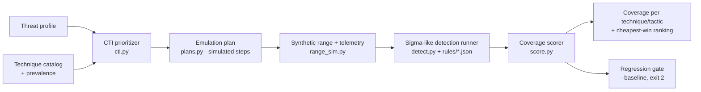

# GAUNTLET

**A threat-informed purple-team range that ranks ATT&CK techniques by how much they matter to you, emulates them, and scores your detection coverage.**

Purple-teaming is usually manual and follows no priority: teams emulate whatever is convenient. GAUNTLET runs the loop **CTI prevalence → prioritized emulation plan → telemetry → Sigma-style detections → coverage matrix → ranked gaps → regression gate**, so detection-engineering time goes to the techniques real actors use.

> **This MVP is simulation-only.** "Emulation" means writing synthetic, labelled telemetry that looks like what a technique would produce. Nothing executes, nothing touches a network, and the project ships no attack tooling or payloads. See [Safety](#lab-only-safety-note).

## Architecture



| Module | What it does |
| --- | --- |
| `models.py` | Typed dataclasses: Technique, ThreatProfile, EmulationStep, Host/Range, Event, Rule, CoverageReport |
| `cti.py` | Technique catalog with illustrative prevalence weights, 3 threat profiles, `relevance × prevalence` ranking, and a breadth-first baseline |
| `plans.py` | Maps each technique to a **simulated** step: inert event templates (placeholders such as `<SIMULATED>`, `.invalid` domains, lab `10.66.x` IPs) |
| `range_sim.py` | 5-host synthetic enterprise, each host with its own log sources. Deterministic, seeded generator of labelled attack events plus benign noise. Models telemetry gaps |
| `detect.py` | Small Sigma-subset engine: field modifiers (`contains`, `startswith`, `endswith`, `re`, `gte`), OR lists, `selection and not filter`, threshold/distinct aggregation |
| `score.py` | Scores each technique as detected, partial or missed. Counts false positives on benign noise, gives per-tactic coverage, ranks "cheapest wins" (one telemetry source that fixes N techniques goes above a single rule) and diffs against a baseline to catch regressions |
| `cli.py` | `gauntlet profiles`, `plan` and `run` (`--json`, `--baseline`, `--disable-source`, `--rules`, `--top`, `--seed`) |

## Quickstart

```bash
pip install -r requirements.txt          # only pytest; runtime is stdlib-only
python -m gauntlet plan --profile ransomware --top 10
python -m gauntlet run  --profile ransomware
python -m gauntlet run  --profile espionage --disable-source mail   # simulate a telemetry gap
python -m gauntlet run --json baseline.json                         # save a baseline
python -m gauntlet run --baseline baseline.json                     # exits 2 on a coverage regression
make test && make demo
```

Sample output (ransomware profile, shipped rules): 60% coverage, 0 false positives, with the uncovered techniques (T1021.002, T1078, T1053.005, T1082) ranked by priority as the next rules to write.

### Demo scenarios covered
1. **Threat-informed plan**: `plan --profile ransomware` lists that actor's highest-weighted techniques first.
2. **Gap → fix**: drop `rules/lsass_access.json` and T1003.001 goes red. Restore it and it goes green (`test_coverage_gap_then_fix`).
3. **Regression catch**: remove a rule and run with `--baseline`, and the run exits 2 with `T1490: detected -> missed`.
4. **Cheapest win**: `--disable-source sysmon` puts "enable sysmon" at the top, because it unlocks 7 or more techniques.

## Writing rules

```json
{"id": "vss_delete", "title": "Shadow copy deletion", "techniques": ["T1490"],
 "logsource": "sysmon",
 "detection": {"selection": {"EventID": 1, "CommandLine|contains": "delete shadows"},
               "condition": "selection"}}
```

## Prior art and how this differs

| Existing | What it does well | GAUNTLET's angle |
| --- | --- | --- |
| MITRE Caldera | Full adversary emulation | Coverage measurement and CTI prioritization are first-class here, not DIY |
| Atomic Red Team | Library of atomic tests | Adds the orchestration, prioritization and scoring layer on top (execution is TODO) |
| VECTR | Tracks purple-team results | Automatic priority from CTI, machine-scored outcomes, a CI regression gate |
| Prelude Operator | Emulation platform | Open, reproducible loop from CTI to emulation to measurement |

GAUNTLET does **not** reinvent emulation. Its contribution is the closed loop and the scoring. Real execution would sit behind Caldera or Atomic Red Team inside an isolated range.

## Lab-only safety note

- The MVP only generates **synthetic data**. It has no subprocess calls, no network I/O and no payloads. A test (`test_plans_are_inert_no_real_payloads`) checks that simulated steps contain only `.invalid` domains and lab IPs.
- Any future real-emulation backend must run **only** inside an isolated range you own: an internal-only network with no egress (see `range/docker-compose.yml`), and never against third-party systems. See [THREAT_MODEL.md](THREAT_MODEL.md) and [SECURITY.md](SECURITY.md).

## Roadmap / TODO (not in this MVP)

| Item | Grade | Status |
| --- | --- | --- |
| Real CTI prevalence feed (Red Canary TDR, OCCAM integration) | C | TODO. Weights in `cti.py` are illustrative |
| Caldera / Atomic Red Team orchestration in the isolated range | B/C | TODO. Needs a range and a kill-switch |
| Docker/VM range provisioning plus Sysmon/eBPF (ROOTLINE) collection | B/C/D | Only a sketch in `range/docker-compose.yml` |
| Full Sigma support (sigma-cli / pySigma backends, `1 of`, aggregation syntax) | B | TODO. The current engine is a documented subset |
| ML detectors (FEINT) and technique co-occurrence prediction | C | TODO |
| Heatmap UI / ATT&CK Navigator layer export | B | TODO |
| Safe-isolation verification (egress tests, network policy audit) | D | TODO. Needs human security review |
| Research question: CTI-prioritized vs breadth-first time-to-coverage | A/D | `cti.breadth_first` baseline exists, experiment not yet run |
