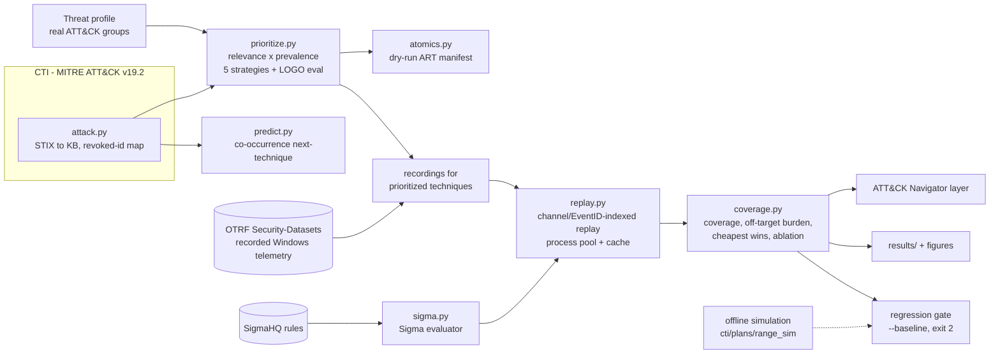

# Architecture

| Module | Purpose |
|---|---|
| `attack.py` | Parses ATT&CK STIX 2.1 into techniques, tactics, groups (software-inherited techniques included), prevalence and the revoked-id map (for example T1086 → T1059.001). A 426 KB derivative ships in the package |
| `prioritize.py` | Builds profiles from real groups (regex over group descriptions or explicit IDs) and ranks with the `cti`, `relevance`, `prevalence`, `breadth` and `random` strategies. Includes the leave-one-group-out evaluation |
| `sigma.py` | Evaluates SigmaHQ YAML directly. Supports the full condition grammar (except aggregations), 20+ modifiers, Sysmon/Security-4688/PowerShell logsource and field mapping. Anything unsupported is reported, never silently ignored |
| `mordor.py`, `replay.py` | Load OTRF recordings (zip or tar.gz, JSON lines) and replay them through a rule set indexed by `(channel, EventID)`, in parallel and cached |
| `coverage.py` | Scores family and exact-ID matches, off-target alert burden, threat-weighted coverage, greedy cheapest-win rules and channel ablation, and exports ATT&CK Navigator 4.5 layers |
| `predict.py` | Item-item cosine co-occurrence model with leave-one-group-out evaluation against a popularity baseline |
| `atomics.py` | Atomic Red Team Windows index and a DRY-RUN manifest in priority order |
| `bench.py`, `figures.py` | The whole benchmark, which writes `results/` |
| `cti.py`, `plans.py`, `range_sim.py`, `detect.py`, `score.py` | The v0.1 offline simulation, kept as a zero-download demo of the regression gate |

Design decisions are recorded in [ADRs](adr/index.md).
