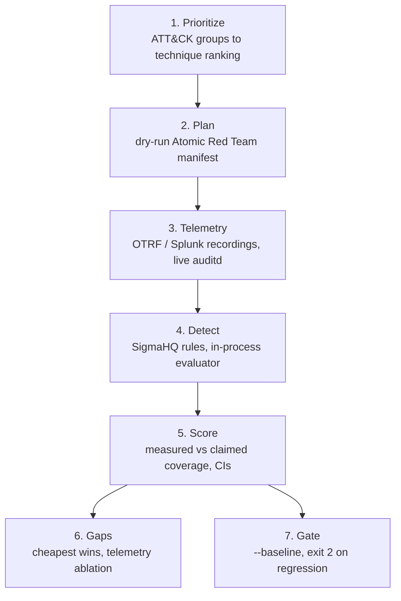

# How it works

GAUNTLET runs one loop: **CTI → prioritized plan → telemetry → detections → coverage → ranked gaps → regression gate**. Each stage below shows a real command and its output.



## 1. Prioritize: what do real actors do?

`attack.py` parses ATT&CK Enterprise v19.2 (176 groups, 697 techniques). A threat profile is a set of real groups (for example 18 ransomware groups). `prioritize.py` ranks techniques by *relevance* (share of profile groups using it) times *prevalence* (share of all groups).

```bash
gauntlet plan --profile ransomware --top 5
```

Leave-one-group-out testing shows that this ordering reaches 80% of a held-out actor's techniques in 118.9 emulations, against 194.4 for ATT&CK-ID (breadth-first) order. Global prevalence explains most of that gain: see [Evaluation](evaluation.md#prioritization).


## 2. Plan

`gauntlet manifest --profile ransomware --top 10 --out plan.json` writes Atomic Red Team test names and GUIDs in priority order, marked **DRY RUN**. GAUNTLET never runs them.

## 3. Telemetry: recorded and live

| Source | What | Labels |
|---|---|---|
| OTRF atomic | 98 Windows recordings; all but two are labelled with one technique (the others carry 2 and 4) | per recording |
| OTRF compound | 7 multi-technique LSASS campaigns | per recording |
| Splunk attack_data | 552 recordings with Windows XML and Linux (Sysmon, auditd) files; each file is scored with its platform's rules | per recording |
| Live auditd (CI) | allowlisted benign discovery commands on a GitHub runner | **per event** (PID-matched) |

`formats.py` parses JSON lines, XML event lines and raw auditd. It merges `SYSCALL` + `EXECVE` + `CWD` records into process-creation events so that Linux `process_creation` rules can run on auditd.

## 4. Detect

`sigma.py` evaluates SigmaHQ YAML directly: the full condition grammar, more than 20 modifiers, and logsource and field mapping for Windows and Linux. Rules are indexed by (channel, EventID). `replay.py` streams every event through the candidate rules in a process pool and caches the results, keyed by a fingerprint of the rules and the evaluator code.

```bash
gauntlet replay --profile ransomware --top 15 --ruleset sigma-core --navigator layer.json --json baseline.json
```

## 5. Score: measured, not claimed

`coverage.py` counts a technique as covered when a rule *tagged with the same technique family* fires on a recording of it (*on-target*). Rules that fire but are not on-target count as *off-target* alert burden. `extended.py` compares this measurement with what the rule tags alone would claim:


## 6. Gaps

Greedy *cheapest wins* lists the few rules that buy the most threat-weighted coverage. The channel ablation shows which log source each detection depends on. The live job adds one more kind of gap: a rule that matches `EXECVE a0 == "whoami"` misses `/usr/bin/whoami`.

## 7. Gate

```bash
gauntlet replay --profile ransomware --top 15 --ruleset sigma-core --baseline baseline.json
echo $?    # 2 if any technique went detected -> missed
```

The same gate works offline with `gauntlet sim --baseline`, and CI runs it on every push.
